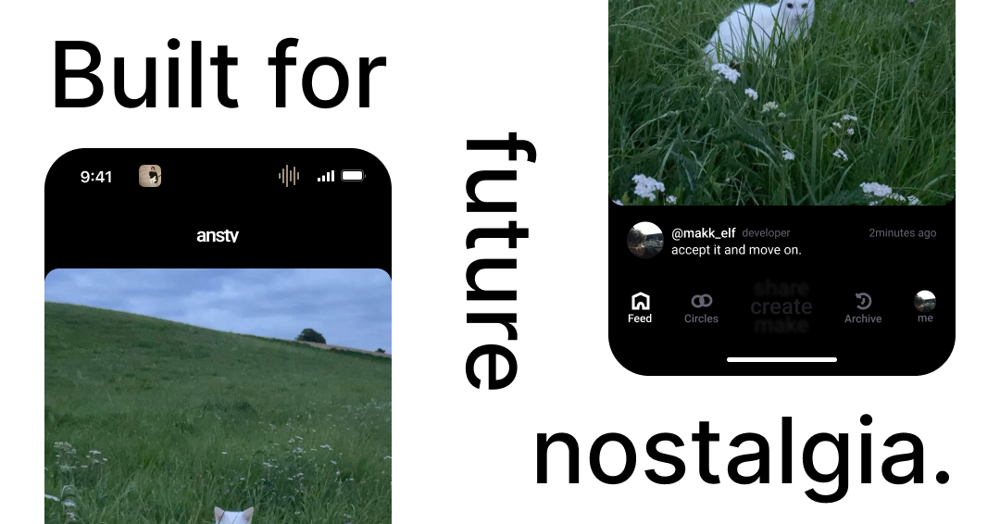

### ansty

> *“Your life is not content.”*

When we post photos on social media, we try to please everyone, stand out, and present ourselves in a perfect way, calling it “aesthetic.” But in reality, beauty and aesthetics are found in simplicity and imperfection - in the moment itself. 

[Website](https://ansty.app) &nbsp;.&nbsp; [App Store](https://ansty.app) &nbsp;.&nbsp; [Google Play](https://ansty.app) &nbsp;.&nbsp; [AppGallery](https://ansty.app)

 

